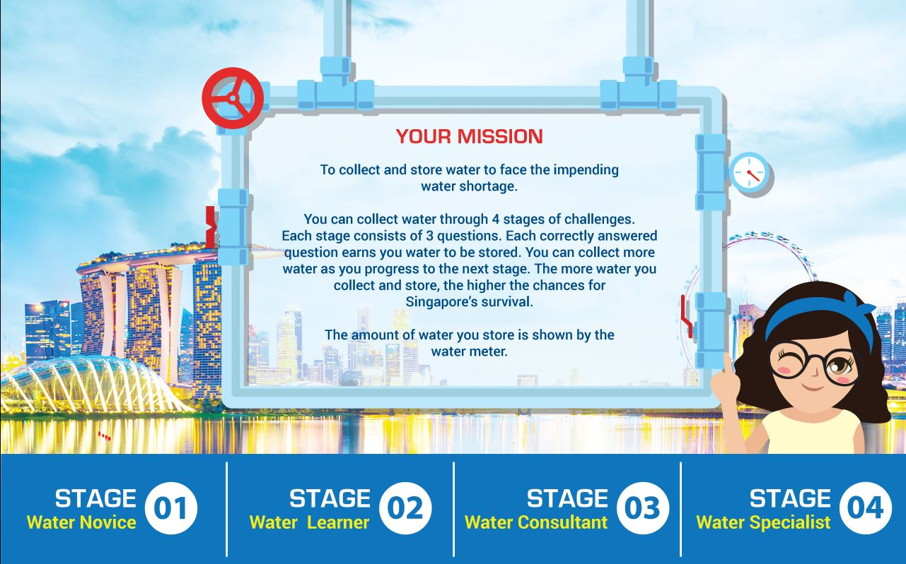

# Water Saving Q&A Challenge – Interactive Learning Game

## Project Desscription
This project is an **interactive, stage-based water conservation quiz** designed for educational kiosks, school exhibitions, and environmental awareness programs. The experience simulates the urgent mission of saving Singapore from an impending water shortage.

**Project Description:** [schoolapp.sg/project/marsiling-secondary-school-environmental-hub/](https://schoolapp.sg/project/marsiling-secondary-school-environmental-hub/)

**Live Demo:** [demo.schoolapp.sg/waterquiz](https://demo.schoolapp.sg/waterquiz)

**YouTube Video:** [www.youtube.com/watch?v=TV3gAqw4jh4](https://www.youtube.com/watch?v=TV3gAqw4jh4)

 

---

## 🎮 Game Concept

### 📝 **Your Mission**

To collect and store water to help Singapore survive the water crisis. You will embark on a journey through **4 levels of challenges**:

| Stage | Title | Description |
|-------|-------|-------------|
| 01 | Water Novice | Beginner questions to get familiar with water conservation |
| 02 | Water Learner | Intermediate knowledge test |
| 03 | Water Consultant | Advanced level water saving scenarios |
| 04 | Water Specialist | Master-level challenge for true water heroes |

Each stage has **3 quiz questions**. A correct answer **earns water to be stored** in your virtual water meter. The more correct answers, the more water you store. The meter visually indicates your success and Singapore’s chance of survival.

---

## 🛠️ Technology Stack

- **HTML5**
- **CSS3 for animation**
- **JavaScript for scoring & interactivity**

---

## Educational Value
The Water Saving Q&A Challenge aims to:

Instill awareness about water conservation

Promote critical thinking on sustainable practices

Provide a fun learning experience for students and the public

## Contact Us
Do you want to customize this for your school, event, or exhibition?
We build tailor-made interactive applications.

🌐 Visit: [schoolapp.sg](https://schoolapp.sg/)  

📧 Email: [enquiry@schoolapp.sg](mailto:enquiry@schoolapp.sg)

## License

This project is licensed under the MIT License.  
See the [`LICENSE`](./LICENSE) file for full details.
